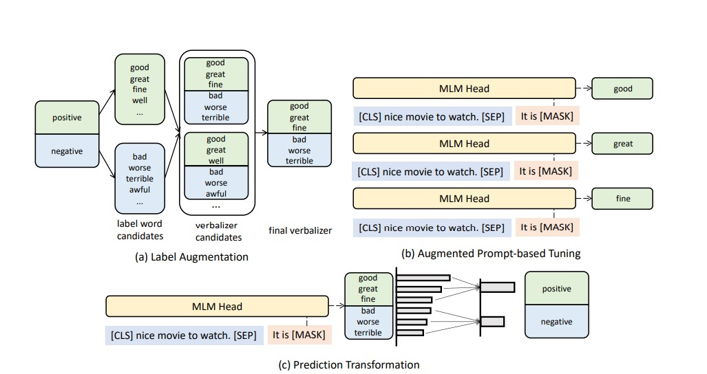

# Paper_Reading_Report
My name is CHI YU. The repo is my paper reading report.
## 1. Open-Domain Aspect-Opinion Co-Mining with Double-Layer Span Extraction (KDD 2022)

### Introduction
1. Weak Label Generator: A rule-based parse tree is used to generate weak labels, identifying potential Aspect and Opinion spans within a sentence.

2. Aspect & Opinion Extraction is performed using a two-layer span extraction model.

3. The first layer extracts individual Aspects or Opinions.

4. The second layer extracts Aspect-Opinion pairs.

5. The outputs of the first and second layers are used for cross-validation.

6. Cross-entropy loss is used as the training objective.

7. The model calculates correlation between outputs from different layers.

8. Self-training is applied: only training data predicted correctly by all four models is reused for further training.

## 2. PromptDA: Label-guided Data Augmentation for Prompt-based Few-Shot Learners

### Introduction
The goal of the paper is to augment the verbalizer (label word), because in the traditional prompt learning, it needs manual effort to design the verbalizer(label word).
1. Label augmentation: Search multiple label words and select the top-k with high probability for the verbalizer.
2. Augmented Prompt Learning: We get multiple training data to help us train the model.
3. Prediction in Prompt learning: Input the sentence including a masked sentence, and put it into the model. The predicted token for the [MASK] determines the corresponding category for classification.

