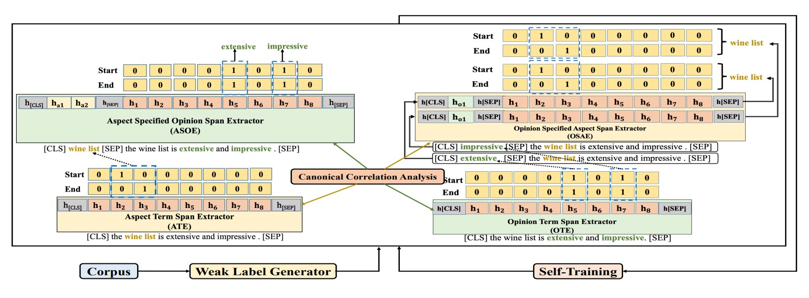

# Paper_Reading_Report
Here there my name is Tony.This repo is my lab paper reading report,speaker is me.
## 1. Open-Domain Aspect-Opinion Co-Mining with Double-Layer Span Extraction (KDD 2022)

### Introduction
1. Using the rule base parser tree to label where Apsect & Opinion span possible in a sentence
2. Aspect & Opinion Extraction use the two layer 
3. First layer only extract single Aspect or Opinion
4. Second layer extract the pair of Aspect & Opinion
5. So here we will get fourth model
6. Loss is the cross Entropy & We also calculate correlation with each other model output
7. Self-train: Use the train data that is predict correct (in four model)
